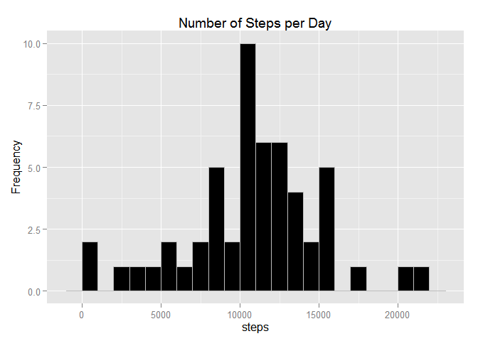
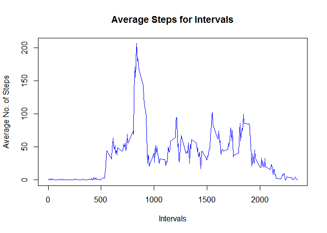
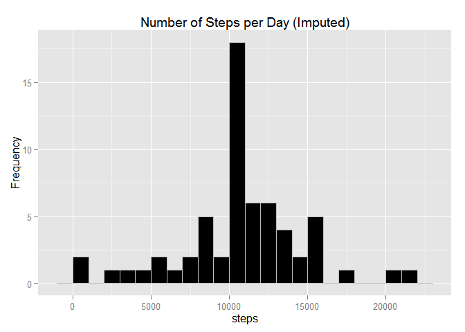
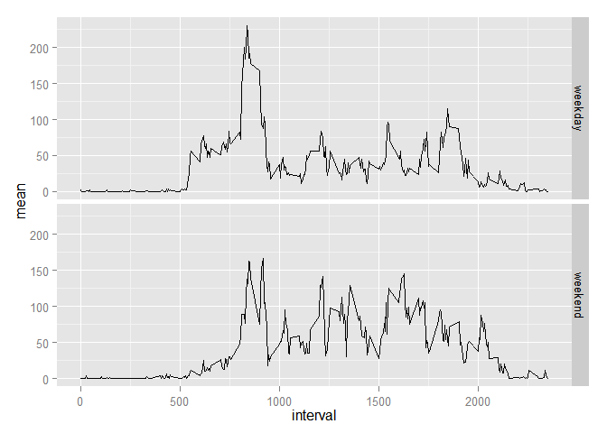

# Reproducible Research: Peer Assessment 1


## Loading and preprocessing the data


```r
activity <- read.csv("activity.csv", header = TRUE, sep = ",")
```


## What is mean total number of steps taken per day?


```r
library(ggplot2)
day_sum <- aggregate(steps ~ date, data=activity, FUN=sum, na.rm = TRUE)
qplot(steps, data = day_sum, binwidth = 1000, fill= I("black"), colour=I("grey"), ylab="Frequency", main="Number of Steps per Day")
```

 

Mean Steps per day:

```r
mean(day_sum[,"steps"])
```

```
## [1] 10766.19
```
Median Steps per day:

```r
median(day_sum[,"steps"])
```

```
## [1] 10765
```

## What is the average daily activity pattern?


```r
int_avg <- aggregate(steps ~ interval, data=activity, FUN=mean, na.rm = TRUE)

plot(int_avg$interval, int_avg$steps, xlab="Intervals", ylab="Average No. of Steps", type="l", col="blue",
     main="Average Steps for Intervals")
```

 

```r
paste("The 5-Min interval that contains the maximum number of steps is", int_avg[which.max(int_avg$steps),]$interval)
```

```
## [1] "The 5-Min interval that contains the maximum number of steps is 835"
```

```r
#Imputing missing values
paste("The total number of rows with N/A is", length(activity[is.na(activity$steps),"steps"]))
```

```
## [1] "The total number of rows with N/A is 2304"
```


## Imputing missing values

Total number of missing values in the dataset

```r
sum(is.na(activity))
```

```
## [1] 2304
```
All missing values will be filled with mean value for the 5-minute interval.


```r
# Merge with Interval Average from non-NA records by Interval
activity_impute <- merge(activity, int_avg, by="interval")
# Assign missing value with mean value for the corresponding time interval
activity_impute <- transform(activity_impute, steps.x = ifelse(is.na(steps.x),steps.y,steps.x))
# Trim off mean values
activity_impute <- activity_impute[,c(1,3,2)]
# Assign meaningful column names
colnames(activity_impute) <- c('interval', 'date', 'steps')

# Histogram of the total number of steps taken per day with imputed values

day_sum2 <- aggregate(steps ~ date, data=activity_impute, FUN=sum, na.rm = TRUE)
qplot(steps, data = day_sum2, binwidth = 1000, fill= I("black"), colour=I("grey"), ylab="Frequency", main="Number of Steps per Day (Imputed)")
```

 

```r
# Mean Steps per Day with imputed values
mean(day_sum2$steps)
```

```
## [1] 10766.19
```

```r
# Median Steps per Day with imputed values
median(day_sum2$steps)
```

```
## [1] 10766.19
```

Mean remains the same mainly because the means were used as default to fill the NA values.
Median is slightly higher. Since the means were used to fill the NA values, the median did 
not deviate from the original by much. 


## Are there differences in activity patterns between weekdays and weekends?


```r
# Convert the field that contains the date to Date field

activity_impute$date <- as.Date(activity_impute$date)

# Add Day of the week to data set

activity_impute$day_of_week <- weekdays(activity_impute$date)

# Create field to indicate weekday or weekend
activity_impute$wd_or_we[!(activity_impute$day_of_week %in% c('Saturday', 'Sunday'))] <- "weekday"
activity_impute$wd_or_we[activity_impute$day_of_week %in% c('Saturday', 'Sunday')] <- "weekend"
activity_impute$wd_or_we <- as.factor(activity_impute$wd_or_we)

# Make a panel plot containing a time series plot (i.e. type = "l") of the 5-minute interval (x-axis)
# and the average number of steps taken, averaged across all weekday days or weekend days (y-axis). 

int_summary2 <- aggregate(steps ~ interval + wd_or_we, data=activity_impute, FUN=mean)
colnames(int_summary2) <- c('interval', 'wd_or_we', 'mean')
qplot(interval, mean, data=int_summary2, geom="line", facets = wd_or_we~., binwidth = 2)
```

 
